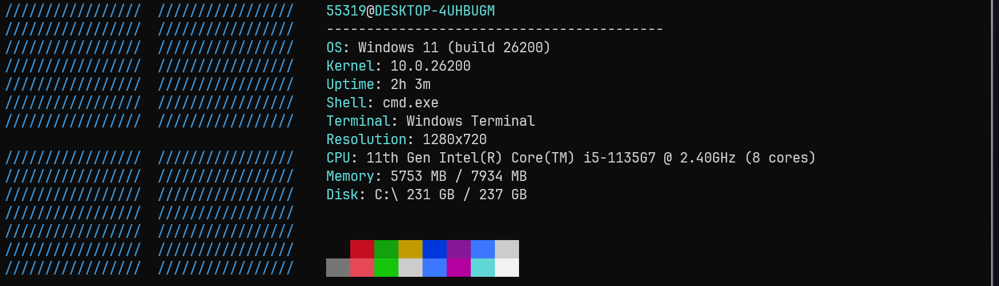

<div align="center">


# WinFetch

### A completely unnecessary system fetch utility for Windows.

[](../../releases)
[](../../stargazers)
[](../../network/members)
[](../../issues)
[](LICENSE)
[]()

<br>

*"Built for learning. (Not) Useful by accident."*

</div>

---

## Overview

WinFetch is a lightweight command-line utility that displays system information in a clean and familiar format.

The project was created purely as a learning exercise. It is not intended to compete with existing fetch utilities, provide advanced diagnostics, or become the next essential Windows tool.

It simply prints information about your system.

That's it.

---

## Screenshot

<div align="center">



</div>

---

## Features

| Feature | Status |
|----------|----------|
| Windows system information | I mean, kinda of |
| Fast startup | Prob no |
| Minimal dependencies | Idk |
| Terminal-friendly output | Idk |
| Enterprise-grade architecture | No |
| Revolutionary innovation | No |
| Solves world hunger | Not yet |

---

## Installation

Download the executable or build the project from source.

Then run:

```powershell
winfetch
```

---

## Usage

```powershell
winfetch
```

No configuration.

No setup wizard.

No account creation.

No telemetry.

No cloud synchronization.

No nothing.

No everything.

Just no.

Maybe a

```powershell
winfetch
```

---

## Example Output

```text
Bruh go see screenshot section I ain't copying the ascii caracteres from my terminal
```

---

## Building

```powershell
git clone https://github.com/YOUR_USERNAME/winfetch.git

cd winfetch

cargo build
```

---

## Project Structure

```text
winfetch/
│
├── assets/
│   ├── banner.png
│   └── screenshot.png
│
├── src/
│
├── README.md
│
└── LICENSE
```

---

## Why?

Most developers eventually reach one of these stages:

1. "I want to learn how Windows APIs work."
2. "I should build something small."
3. "Maybe I'll create my own fetch utility."
4. Three hours later: WinFetch.

This repository is the result of that process.

---

## Goals

- Learn more about Windows internals
- Experiment with terminal output
- Explore native system information APIs
- Build something complete, even if simple

---

## Non-Goals

- Replacing existing fetch tools
- Becoming production software
- Collecting analytics
- Adding AI features
- Creating a startup

---

## Performance

WinFetch was designed around a single guiding principle:

> Start fast. Print information. Exit.

Anything beyond that would probably be overengineering.

---

## Contributing

Contributions are not welcome.

Bug fixes, improvements, refactors, and suggestions are not appreciated.

If you find a problem, solve it yourself, im not doing any of that.

If you have a better way to implement something, implement it yourself, im not doing any of that.

If you want to rewrite the entire project for no reason whatsoever, that's also acceptable.

---

## FAQ

### Is WinFetch better than other fetch tools?

No.

### Is it faster?

No.

### Does it have more features?

Definitely not.

### Then why does it exist?

Because building things is fun.

---

## Acknowledgements

Inspired by the long tradition of developers creating fetch utilities instead of doing what they were originally supposed to do.

Special thanks to every project that made someone think:

> "I could probably build that myself."

---

## License

Released under the MIT License.

See the [LICENSE](LICENSE) file for details.

---

<div align="center">


<br><br>

**WinFetch**

*A study project that somehow became a real repository.*

</div>
